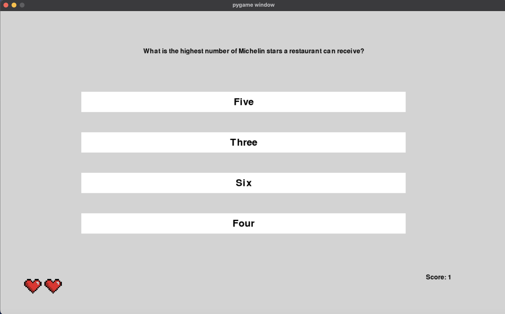

:warning: Everything between << >> needs to be replaced (remove << >> after replacing)

# Trivia Master
## CS110 Final Project  Fall, 2024

## Team Members

Kris Patel

***

## Project Description

A quiz game with randomized questions and 4 choices for answers. It keeps track of your score, and you have three lives.

***    

## Uses pygame_menu for external module

## GUI Design

### Initial Design

### Final Design

## Program Design

### Features

1. Random Question Generation
2. Multiple Choices
3. Score Keeper
4. Life tracker
5. Menu

### Classes

- Trivia: Takes data from trivia API
- Answers: Creates answer buttons
- Lives: Keeps track of lives

## ATP

| Test Case              |Procedure             |Expected Results                   |
|----------------------|:--------------------:|----------------------------------:|
|  1  Start Program      | Type python3 main.py into terminal and click enter     |GUI window appears with menu that has a start button  |
|  2  Score Counter      | Start game, answer a question correctly                | score changes to be = 1                              |
|  3  Life removal       | Start game, answer a question incorrectly              | lives change from 3 to 2                             |
|  4  Random Question    | Start game, answer a question correctly                | next question should be different                    |
|  5  Game Over          | Start game, answer 3 questions incorrectly             | display gameover                                     |

