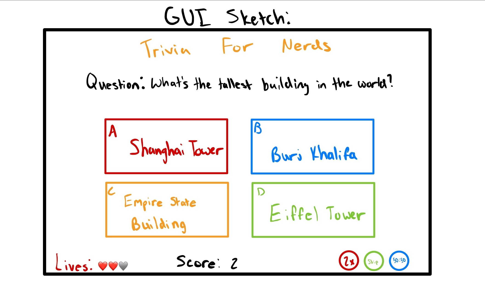

:warning: Everything between << >> needs to be replaced (remove << >> after replacing)

# Trivia Master
## CS110 Final Project  Fall, 2024

## Team Members

Kris Patel

***

## Project Description

A quiz game with randomized questions and 4 choices for answers. It keeps track of your score, and you have three lives.

***    

## GUI Design

### Initial Design

### Final Design

## Program Design

### Features

1. Random Question Generation
2. Multiple Choices
3. Score Keeper
4. Life tracker
5. Power-ups

### Classes

- Question: 
- Answers: 
- Lives: 
- Score: 

## ATP

| Step                 |Procedure             |Expected Results                   |
|----------------------|:--------------------:|----------------------------------:|
|  1                   | Run Counter Program  |GUI window appears with count = 0  |
|  2                   | click count button   | display changes to count = 1      |
etc...
